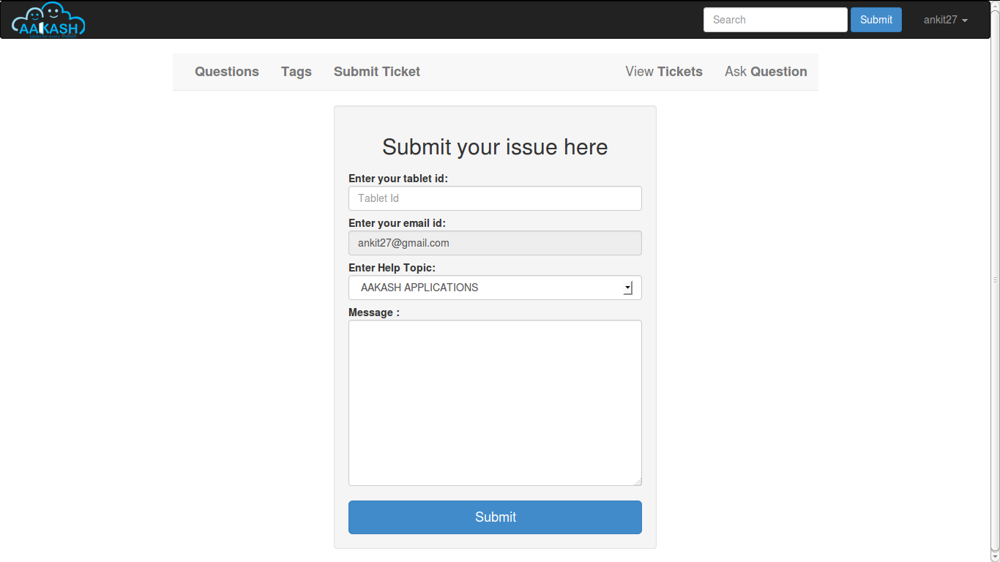
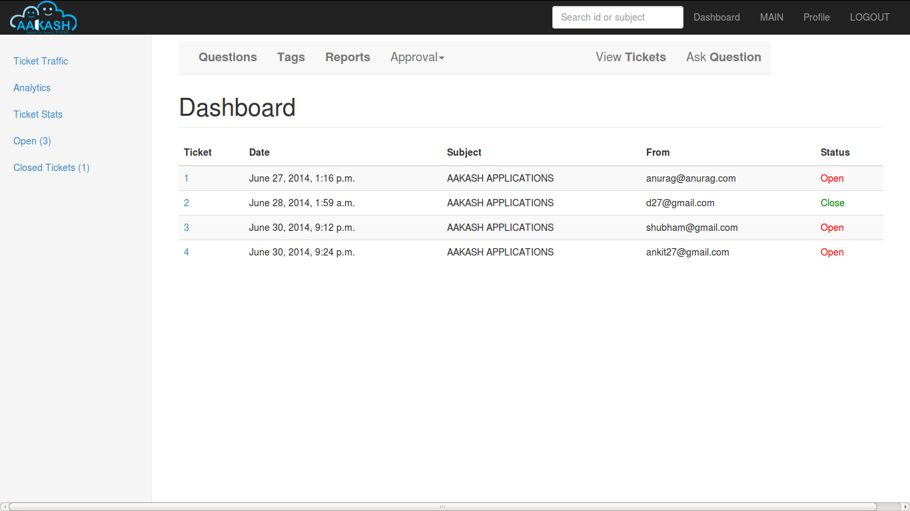

User's guide
============

Introduction
------------

The Aakash Tech Support Portal is a online Portal, which is divided into two modules, Aakash Tech Support and Discussion forums.

Tech support Provided a Aakash tablet users a platform to discuss the technical Problem that they face with the tablet. Discussion Forum, FAQ and submit ticket features are provided to the users to help him solve the problem.

Aakash Portal is Open Source software. Therefore it is going to be freely available. It is Platform Independent, easy to operate and maintain.

* Why Python-Django

  - Python is a very-high-level dynamic object-oriented programming
    language.It’s designed to be easy to learn, read and program.

  - *Python is open*: Python is open source software, distributed
      under a liberal license, and can thus be distributed freely.

  - *Python is general purpose*: Python is a general purpose language,
      which means that many things are made easy. Examples are string
      processing, reading/writing files, sockets, websites, databases,
      GUI’s.

  - *Python is dynamic*: Being a dynamic language means that new code
    can be executed during runtime without limitations.

  - Django is a high-level Python Web framework that encourages rapid
    development and clean, pragmatic design.

  - Django was designed to handle two challenges: the intensive
    deadlines of a newsroom and the stringent requirements of the
    experienced Web developers who wrote it.

  - Django's primary goal is to ease the creation of complex,
    database-driven websites. Django emphasizes reusability and
    "pluggability" of components, rapid development.

  - Django follows the model–view–controller architectural
    pattern.Lets dive into what is MVC Design Pattern.The first thing
    to note is that that we split it over four Python files
    (``models.py``, ``views.py``, ``urls.py``) and an HTML template
    (``latest_uploads.html``):

  - ``models.py`` (the database tables) ::

	from django.db import models

	class Subject(models.Model):
	    name = models.CharField(max_length=50)
	    upload_date = models.DateField()

  - ``views.py`` (the business logic) ::

	from django.shortcuts import render
	from models import Subject

	def latest_uploads(request):
	    uploads_list = Subject.objects.order_by('-upload_date')[:10]
	    return render(request, 'latest_uploads.html', {'uploads_list': uploads_list})

  - ``urls.py`` (the URL configuration) ::

	from django.conf.urls.defaults import *
	import views

	urlpatterns = patterns('',
	    (r'^latest/$', views.latest_uploads),
	)

  - ``latest_uploads.html`` (the template) ::

	<html><head><title>Uploads</title></head>
	<body>
	<h1>Uploads</h1>
	<ul>
	
	<li>{{ uploads.name }}</li>
	
	</ul>
	</body></html>

Advantage of using python over other programming languages

- Python programs run slower than the Java codes, but python saves
  much time and space. Python programs are 3-5 times smaller than java
  programs.

- Python is dynamic typed language. Python programmers don't need to
  waste time in declaring variable types as in java.

- The program length in python is 5-10 times shorter than that in C++.

- Unlike other programming languages python code has to be strictly
  indented but the indentation helps in much cleaner code(readable).

- High level data structures are list, directory are well suited in
  python.

- The elegant design and syntax rules of this programming language
  make it quite readable even among the multi programmer development
  teams.

**GIT**

- Git is a free and open source distributed version control system
  designed to handle everything from small to very large projects with
  speed and efficiency.

- Git allows groups of people to work on the same documents (often
  code) at the same time, and without stepping on each other's toes.

- GitHub is now the largest online storage space of collaborative
  works that exists in the world.

- If you and a co-worker are both updating code on the same
  website. You make your changes, save them, and upload them back to
  the website. So far, so good. The problem comes when your co-worker
  is working on the same code as you at the same time. One of you is
  about to have your work overwritten and erased.  A version control
  application like Git keeps that from happening.

- You and your co-worker can each upload your revisions to the same
  code, and Git will save two copies. Later, you can merge your
  changes together without losing any work along the way.

**GNU/Linux**

- GNU is a Unix-like computer operating system developed by the GNU
  Project. It is composed wholly of free software. It is based on the
  GNU Hurd kernel and is intended to be a "complete Unix-compatible
  software system".

- The system's basic components include the GNU Compiler Collection
  (GCC), the GNU C library (glibc), and GNU Core Utilities
  (coreutils), but also the GNU Debugger (GDB), GNU Binary Utilities
  (binutils),the bash shell and the GNOME desktop environment.

- The GNU Project has endorsed variants using the Linux kernel, such
  as gNewSense, Trisquel and Parabola GNU/Linux-libre.

- LINUX is also a Unix-like and mostly POSIX-compliant computer
  operating system assembled under the model of free and open source
  software development and distribution.

- The underlying source code may be used, modified, and
  distributed—commercially or non-commercially—by anyone under
  licenses such as the GNU General Public License.

- Typically, Linux is packaged in a format known as a Linux
  distribution for desktop and server use. Some popular mainstream
  Linux distributions include Debian, Ubuntu, Linux Mint, Fedora, Arch
  Linux, and the commercial Red Hat Enterprise Linux and SUSE Linux
  Enterprise Server.

- Linux distributions include the Linux kernel, supporting utilities
  and libraries and usually a large amount of application software to
  fulfill the distribution's intended use.

- The open-source software movement arose to clarify the environment
  that the new copyright, licensing, domain, and consumer issues
  created.

- Open-source code is typically a collaborative effort where
  programmers improve upon the source code and share the changes
  within the community so that other members can help improve it
  further.

- Distros designed to replace your existing operating system some
  other linux distros are Ubuntu,OpenSUSE,Fedora etc.

- Ubuntu is a Debian-based Linux operating system, with Unity as its
  default desktop environment (GNOME was the previous desktop
  environment).Ubuntu is the most popular desktop Linux distribution.

- The Ubuntu project is publicly committed to the principles of open
  source development; people are encouraged to use free software,
  study how it works, improve upon it, and distribute it.

Description
-----------

Here you will describe your project's workflow like how the different
sections(Books, Contributor, Reviewer) are divided and why. Basically
you will talk about models buy in layman term. This should be
understood by any non-technical user. This section should consume
about 70% of the user-guide.

Workflow
~~~~~~~~

Describe models(in layman terms)

Interface
~~~~~~~~~

Explain each page in detail with screen-shots.

Example:

   Login page

Ticketing System
~~~~~~~~~~~~~~~~

The ticket submission system allows the user to submit his issues for resolution by the tech support officials in case the FAQs and discussion forum do not provide enough information.

The user is able to go to the submit ticket page by clicking on the link to the same on the home page; provided he is logged in.A user is allowed to submit a ticket only if he is logged in. If a user tries to submit a ticket without being logged in; he is redirected to the login page.Once the user has been logged in and is on the submit ticket page; in order for him to submit his issue he has to provide the following details:

* Tablet id: The tablet id is an eight digit number inscribed on the back of every aakash tablet.
* Message: The details of the problem that the user is facing goes here.
* Category of the problem: The user is given a drop down list of categories to select from.
* Email : The email field is automatically populated with the email id of the logged in user.

   Submit ticket page

Once the user has submitted his details, the tablet id is validated to see that its genuine; following which the user is taken to a page where his unique ticket id is displayed. The user can quote this ticket id later to refer to the problem in future.

A screenshot of the page showing the ticket number so generated is shown below:

.. figure:: _static/img/after_submit.png
   :height: 600 px
   :width: 900 px
   :scale: 50 %
   :alt: Page where ticket id is displayed after submitting the ticket
   :align: center

   Page displaying ticket id after the ticket is submitted

The view tickets feature for the user to view the details of all the tickets submitted by him
~~~~~~~~~~~~~~~~~~~~~~~~~~~~~~~~~~~~~~~~~~~~~~~~~~~~~~~~~~~~~~~~~~~~~~~~~~~~~~~~~~~~~~~~~~~~~

The user can view the details of all the tickets submitted by him; provided he is logged in.

The details displayed include the ticket id, the status of the ticket (whether open or closed), the created date and time of the ticket, the priority of the ticket, the tablet id of the user, the message submitted by the user and the reply posted by the admin
The link for the user to view his submitted tickets’ details is present on the page displayed to the user once he logs in. If the user is not logged in; he is not shown the link to view the submitted tickets.

The user can close the ticket once he is satisfied with the reply by clicking on the close ticket option.

The following screenshot shows the page containing the ticket details of the user; when he clicks on the view tickets link:

.. figure:: _static/img/view_tickets.png
   :height: 600 px
   :width: 900 px
   :scale: 50 %
   :alt: page containing the ticket details of the user
   :align: center

   Page containing the ticket details of the user

The chart/graph display system on the admin dashboard
~~~~~~~~~~~~~~~~~~~~~~~~~~~~~~~~~~~~~~~~~~~~~~~~~~~~~

The admin can conveniently visualize the statistics about the tickets generated and resolved by using interactive charts and graphs.
Three different graphs/charts have been implemented:

* A pie chart showing the Category-wise breakup of tickets.

   pie chart showing the Category-wise breakup of tickets

* A pie chart showing the number of open vs number of closed tickets.

   
    pie chart showing the number of open vs number of closed tickets

* A bar chart showing the number of tickets generated per month.

   
    pie chart showing the number of tickets generated per month

The pie charts are interactive and can be rendered in different ways as desired by the admin; by clicking on the buttons along the right margin.

The admin dashboard
~~~~~~~~~~~~~~~~~~~
The admin dashboard  system allows the admin to check the submitted issues by aakash  tablet id holders in case the FAQs and discussion forum do not provide enough information.To access the admin panel the admin should be logged in with his corresponding id and  password.The main page of the admin dashboard shows all the tickets submitted by the  user and the category of the  problem.

A screenshot of the page showing the ticket number so generated is shown below:

   
    all the ticket numbers generated so far are shown on the dashboard 

Dashboard Features
~~~~~~~~~~~~~~~~~~

* Graphical Representation of Data : Graphical representation of ticketing data can be access from the admin dashboard pannel

* Search: Admin can search for a specific ticket  submitted by the user by its Ticked ID or by User Email. Admin can also search for ticket in specific categories i.e. by typing ANDROID all the ticket corresponding to the android categories will be displayed in the dashboard

* Report Generation: The admin can download a csv file containing the details of all the tickets submitted so far by clicking on the Reports link on the welcome page.

The  Reply interface between user and admin
~~~~~~~~~~~~~~~~~~~~~~~~~~~~~~~~~~~~~~~~~~~

Reply interface allows admin to reply the query of a specific ticket by clicking on it's Ticket id.
screenshot of the page showing the  reply interface for a particular ticket number is shown below:

.. figure:: _static/img/reply.png
   :height: 600 px
   :width: 900 px
   :scale: 50 %
   :alt: ticket numbers generated so far are shown on the dashboard
   :align: center
   
    all the ticket numbers generated so far are shown on the dashboard 

The above Page show the all Details of a particular ticket along with the problem message submitted by the user. The admin  can reply correspondingly to the problem in the response section and by clicking Post Reply to send a e-mail to the user. The top of the page also shows the statistics of open and close tickets

Conclusion
----------

Give good reasons on how your app/project is going to benefit Aakash
project, students, teachers and general public

Reference
---------

List of reference like books, links you used.

