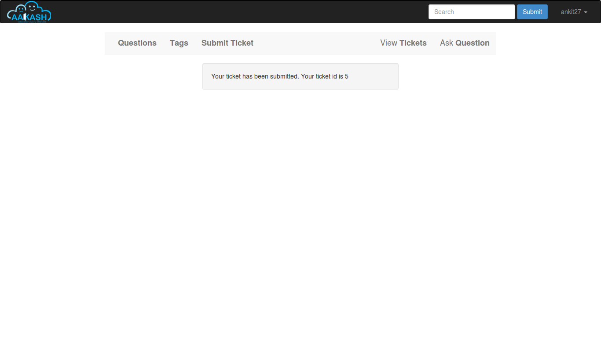
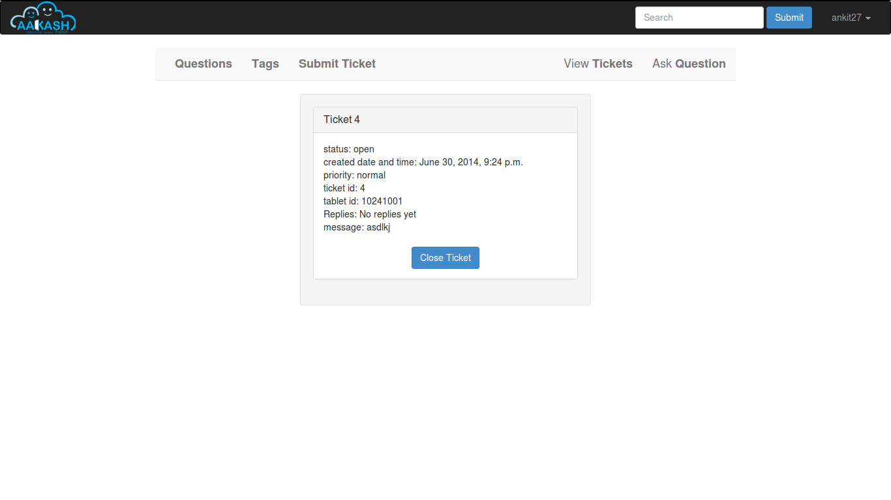

Introduction
============

The Aakash Tech Support Portal is a online Portal, which is divided into two modules, Aakash Tech Support and Discussion forums.

Tech support Provided a Aakash tablet users a platform to discuss the technical Problem that they face with the tablet. Discussion Forum, FAQ and submit ticket features are provided to the users to help him solve the problem.

Aakash Portal is Open Source software. Therefore it is going to be freely available. It is Platform Independent, easy to operate and maintain.

* Why Python-Django

  - Python is a very-high-level dynamic object-oriented programming
    language.It’s designed to be easy to learn, read and program.

  - *Python is open*: Python is open source software, distributed
      under a liberal license, and can thus be distributed freely.

  - *Python is general purpose*: Python is a general purpose language,
      which means that many things are made easy. Examples are string
      processing, reading/writing files, sockets, websites, databases,
      GUI’s.

  - *Python is dynamic*: Being a dynamic language means that new code
    can be executed during runtime without limitations.

  - Django is a high-level Python Web framework that encourages rapid
    development and clean, pragmatic design.

  - Django was designed to handle two challenges: the intensive
    deadlines of a newsroom and the stringent requirements of the
    experienced Web developers who wrote it.

  - Django's primary goal is to ease the creation of complex,
    database-driven websites. Django emphasizes reusability and
    "pluggability" of components, rapid development.

  - Django follows the model–view–controller architectural
    pattern.Lets dive into what is MVC Design Pattern.The first thing
    to note is that that we split it over four Python files
    (``models.py``, ``views.py``, ``urls.py``) and an HTML template
    (``tagged_questions.html``):

  - ``models.py`` (the database tables) ::

	from django.db import models

	class Category(models.Model):
   	    category = models.CharField(max_length=20)
    	    description = models.TextField()

  - ``views.py`` (the business logic) ::

	from taggit.models import Tag
	from models import Category

	def linktag(request, qid):
    	    context = RequestContext(request)
            cat = Category.objects.get(pk=qid)
    	    posts_date = Post.objects.filter(category=cat).order_by('-post_date')
    	    posts_views = Post.objects.filter(category=cat).order_by('-post_views')
	    context_dict = {
       		 'mytag': cat,
       		 'posts_views': posts_views,
       		 'posts_date': posts_date,
            }
 	return render_to_response('questions/tagged_questions.html', context_dict, context)    
    	    

  - ``urls.py`` (the URL configuration) ::

	from django.conf.urls.defaults import *
	import views

	urlpatterns = patterns('',
	     url(r'^tagged_questions/(?P<qid>\d+)/$', views.linktag, name='linktag'),
	)

  - ``tagged_questions.html`` (the template) ::

	<!DOCTYPE html>
	
	

	
	<a class="question-hyperlink" href="/questions/{{ post.pk }}" >
        {{ post.title }}
        </a>
	

        {{ post.body }}
        

	

        <a class="post-tag" rel="tag" href="/questions/tagged_questions/{{ post.pk }}">
        {{ mytag|lower|capfirst }}
        </a>
        

	
	

Advantage of using python over other programming languages

- Python programs run slower than the Java codes, but python saves
  much time and space. Python programs are 3-5 times smaller than java
  programs.

- Python is dynamic typed language. Python programmers don't need to
  waste time in declaring variable types as in java.

- The program length in python is 5-10 times shorter than that in C++.

- Unlike other programming languages python code has to be strictly
  indented but the indentation helps in much cleaner code(readable).

- High level data structures are list, directory are well suited in
  python.

- The elegant design and syntax rules of this programming language
  make it quite readable even among the multi programmer development
  teams.

**GIT**

- Git is a free and open source distributed version control system
  designed to handle everything from small to very large projects with
  speed and efficiency.

- Git allows groups of people to work on the same documents (often
  code) at the same time, and without stepping on each other's toes.

- GitHub is now the largest online storage space of collaborative
  works that exists in the world.

- If you and a co-worker are both updating code on the same
  website. You make your changes, save them, and upload them back to
  the website. So far, so good. The problem comes when your co-worker
  is working on the same code as you at the same time. One of you is
  about to have your work overwritten and erased.  A version control
  application like Git keeps that from happening.

- You and your co-worker can each upload your revisions to the same
  code, and Git will save two copies. Later, you can merge your
  changes together without losing any work along the way.

**GNU/Linux**

- GNU is a Unix-like computer operating system developed by the GNU
  Project. It is composed wholly of free software. It is based on the
  GNU Hurd kernel and is intended to be a "complete Unix-compatible
  software system".

- The system's basic components include the GNU Compiler Collection
  (GCC), the GNU C library (glibc), and GNU Core Utilities
  (coreutils), but also the GNU Debugger (GDB), GNU Binary Utilities
  (binutils),the bash shell and the GNOME desktop environment.

- The GNU Project has endorsed variants using the Linux kernel, such
  as gNewSense, Trisquel and Parabola GNU/Linux-libre.

- LINUX is also a Unix-like and mostly POSIX-compliant computer
  operating system assembled under the model of free and open source
  software development and distribution.

- The underlying source code may be used, modified, and
  distributed—commercially or non-commercially—by anyone under
  licenses such as the GNU General Public License.

- Typically, Linux is packaged in a format known as a Linux
  distribution for desktop and server use. Some popular mainstream
  Linux distributions include Debian, Ubuntu, Linux Mint, Fedora, Arch
  Linux, and the commercial Red Hat Enterprise Linux and SUSE Linux
  Enterprise Server.

- Linux distributions include the Linux kernel, supporting utilities
  and libraries and usually a large amount of application software to
  fulfill the distribution's intended use.

- The open-source software movement arose to clarify the environment
  that the new copyright, licensing, domain, and consumer issues
  created.

- Open-source code is typically a collaborative effort where
  programmers improve upon the source code and share the changes
  within the community so that other members can help improve it
  further.

- Distros designed to replace your existing operating system some
  other linux distros are Ubuntu,OpenSUSE,Fedora etc.

- Ubuntu is a Debian-based Linux operating system, with Unity as its
  default desktop environment (GNOME was the previous desktop
  environment).Ubuntu is the most popular desktop Linux distribution.

- The Ubuntu project is publicly committed to the principles of open
  source development; people are encouraged to use free software,
  study how it works, improve upon it, and distribute it.

Workflow
========

- A model is the single, definitive source of information about your
  data. It contains the essential fields and behaviors of the data
  you’re storing. Generally, each model maps to a single database
  table.Each attribute of the model represents a database field.

 *In this website the various models used :*

- Ticket: This model stores the details of all the tickets and therefore represents a ticket submitted by the user. For each ticket the user id of the user submitting the ticket, the category of the issue, the tablet id of the user, message describing the users problem, the ticket id assigned for that issue, created date time, overdue date time, closed date and time, status of the ticket, i.e. whether open or closed, priority status of the ticket and duration for reply.
	

- Tablet_info: The details of each aakash tablet issued so for are stored in the Tablet_info table. The details include remote center id, remote center name, start id of the tablets issued, end id of the tablets issued, tablet count and city at which the remote center is located.

- Threads: The thread model enables  admin to give more than one reply to a user. Details of each thread such as created date and time , reply posted by the admin, ticket to which the admin posts a reply and the number of replies for a particular ticket.

- UserProfile:The details of each user who registers, is stored in
  the table UserProfile.This table manages the information of each
  user,including his name,username,email-id,password etc. This table 
  is linked with Django's built-in model User.

- Category:The table Category contains the categories of various types
  of questions along with the description of each Category.
  

- Post:Every question that the user asks in the discussion forum, is
  fed into the table Post. In addition, this table contains the name
  of the person who posted the question, along with the date of the post
  along with its no of views and approval status.   
  
   
- Reply:The replies corresponding to the various posts are fed into the
  table 'Reply'. In addition, this table contains the information such as
  name of the user who posted the reply, the date of post of the reply etc.
  
   
- Comment:The comments corresponding to various replies are fed into the 
  table 'Comment'.This table contains the comments along with the name of
  the user who posted the comment and the date of post of comment.

Interface
=========

**Discussion Forum**
~~~~~~~~~~~~~~~~~~~~

The Discuusion Forum is an online site where people can hold conversations
in the form of posted messages.Various kinds of questions are posted are on
the forum where other can answer these questions depending upon their 
knowledge of the topic. 

In our Discussion Forum, the users post their questions regarding Aakash 
Tablet. Other users who are familiar with the problem, can post a reply 
for the same. Every post and reply needs the approval of admin before it gets
published on the Website.

- *User Panel*

	Here, the user can search for questions(issues) related to the Aakash Tablet. The Forum is again sub-divided into sections like 'latest', 'frequent', 'votes' and 'unanswered'.

	* Latest questions

	Questions are diplayed according to their post date and time, the latest queries being on the top.

	* Voted questions

	The most voted queries and replies will appear upfront. Only logged in users can vote for their favourite posts.

	* Frequently viewed questions

	Questions those are frequently searched or viewed are displayed which makes searching easy and simple.

	* Unanswered questions

	Posts without replies are shown. Once answered, they don't show up in this section anymore.

	.. figure:: _static/img/questions.png
	   :height: 600 px
	   :width: 900 px
	   :scale: 50 %
	   :alt: All questions
	   :align: center

	The user can further optimise his search through the 'tags' option. A tag is a keyword or label that categorizes your question with other, similar questions. This will show questions related to a particular tag(category) as selected by the user. Using the right tags makes it easier for others to find and answer your question. This include categories like 'Android problem', 'Back panle damage', 'Booting', 'Camera', 'Charging Problem', 'Wifi Connectivity', 'TouchScreen Problems', etc.

	.. figure:: _static/img/tags.png
	   :height: 600 px
	   :width: 900 px
	   :scale: 50 %
	   :alt: All tags
	   :align: center

	The tags can also be linked with their respective questions by using the search mechanism. The user passes the tag to be searched in a text box which is processed in a view called ‘tag_search’. In this view the name of the tag is fetched from the html textbox and is checked for its availability in the database. If the tag is present, all posts related to it have been displayed. Posts have been displayed by their creation date and can be sorted by their no of views.

	Now, if the user doesn't find the appropriate question he is searching for then he can post his own question using the option 'Ask Question'. But for that, the user needs to login. Only then he is allowed to ask questions.

	.. figure:: _static/img/login.png
	   :height: 600 px
	   :width: 900 px
	   :scale: 50 %
	   :alt: Login
	   :align: center

	.. figure:: _static/img/ask_question.png
	   :height: 600 px
	   :width: 900 px
	   :scale: 50 %
	   :alt: Ask Question
	   :align: center

- *Admin Panel*

	The Admin Interface contains a column for Approval of a Post or Reply.

	.. figure:: _static/img/interface1.png
	   :height: 600 px
	   :width: 900 px
	   :scale: 50 %
	   :alt: Submit ticket page
	   :align: center

	* Approve a Post
	   
	When the Admin clicks on 'Approve a post' option, he gets all the unapproved 
	posts.He can either approve the post or delete a post. He has also got the
	option for editing the post, if reqiuired. Whenever a post is approved,
	a mail is sent to the user who posted the issue. On approving or deleting
	a post, the Admin is directed to the same page.

	.. figure:: _static/img/interface2.png
	   :height: 600 px
	   :width: 900 px
	   :scale: 50 %
	   :alt: Submit ticket page
	   :align: center
	   

	* Approve a Reply
	   
	When the Admin clicks on 'Approve a Reply' option, he gets all the unapproved 
	answers corresponding to the various posts. He can either approve the reply or
	delete it. He has also got the option for editing the reply, if reqiuired.
	Whenever a reply is approved,a mail is sent to the user who posted the issue so
	that he can be informed that his question has been answered. On approving or 
	deleting a reply, the Admin is directed to the same page.

	.. figure:: _static/img/interface3.png
	   :height: 600 px
	   :width: 900 px
	   :scale: 50 %
	   :alt: Submit ticket page
	   :align: center

**Ticketing system**
~~~~~~~~~~~~~~~~~~~~

The ticket submission system allows the user to submit his issues for resolution by the tech support officials in case the FAQs and discussion forum do not provide enough information.

The user is able to go to the submit ticket page by clicking on the link to the same on the home page; provided he is logged in.A user is allowed to submit a ticket only if he is logged in. If a user tries to submit a ticket without being logged in; he is redirected to the login page.Once the user has been logged in and is on the submit ticket page; in order for him to submit his issue he has to provide the following details:

	* Tablet id: The tablet id is an eight digit number inscribed on the back of every aakash tablet.
	* Message: The details of the problem that the user is facing goes here.
	* Category of the problem: The user is given a drop down list of categories to select from.
	* Email : The email field is automatically populated with the email id of the logged in user.

.. figure:: _static/img/submit_ticket.png
   :height: 600 px
   :width: 900 px
   :scale: 50 %
   :alt: Submit ticket page
   :align: center

   Submit ticket page

Once the user has submitted his details, the tablet id is validated to see that its genuine; following which the user is taken to a page where his unique ticket id is displayed. The user can quote this ticket id later to refer to the problem in future.

A screenshot of the page showing the ticket number so generated is shown below:

   Page displaying ticket id after the ticket is submitted

* The view tickets feature for the user to view the details of all the tickets submitted by him

The user can view the details of all the tickets submitted by him; provided he is logged in.

The details displayed include the ticket id, the status of the ticket (whether open or closed), the created date and time of the ticket, the priority of the ticket, the tablet id of the user, the message submitted by the user and the reply posted by the admin
The link for the user to view his submitted tickets’ details is present on the page displayed to the user once he logs in. If the user is not logged in; he is not shown the link to view the submitted tickets.

The user can close the ticket once he is satisfied with the reply by clicking on the close ticket option.

The following screenshot shows the page containing the ticket details of the user; when he clicks on the view tickets link:

   Page containing the ticket details of the user

* The chart/graph display system on the admin dashboard

The admin can conveniently visualize the statistics about the tickets generated and resolved by using interactive charts and graphs.
Three different graphs/charts have been implemented:

  * A pie chart showing the Category-wise breakup of tickets.

	.. figure:: _static/img/category_breakup.png
	   :height: 600 px
	   :width: 900 px
	   :scale: 50 %
	   :alt: pie chart showing the Category-wise breakup of tickets
	   :align: center

	   pie chart showing the Category-wise breakup of tickets

  * A pie chart showing the number of open vs number of closed tickets.

	.. figure:: _static/img/open_vs_closed.png
	   :height: 600 px
	   :width: 900 px
	   :scale: 50 %
	   :alt: pie chart showing the number of open vs number of closed tickets
	   :align: center
	   
	    pie chart showing the number of open vs number of closed tickets

  * A bar chart showing the number of tickets generated per month.

	.. figure:: _static/img/traffic.png
	   :height: 600 px
	   :width: 900 px
	   :scale: 50 %
	   :alt: pie chart showing the number of tickets generated per month
	   :align: center
	   
	    pie chart showing the number of tickets generated per month

The pie charts are interactive and can be rendered in different ways as desired by the admin; by clicking on the buttons along the right margin.

* The admin dashboard

The admin dashboard  system allows the admin to check the submitted issues by aakash  tablet id holders in case the FAQs and discussion forum do not provide enough information.To access the admin panel the admin should be logged in with his corresponding id and  password.The main page of the admin dashboard shows all the tickets submitted by the  user and the category of the  problem.

A screenshot of the page showing the ticket number so generated is shown below:

.. figure:: _static/img/dashboard.png
   :height: 600 px
   :width: 900 px
   :scale: 50 %
   :alt: ticket numbers generated so far are shown on the dashboard
   :align: center
   
    all the ticket numbers generated so far are shown on the dashboard 

* The  Reply interface between user and admin

Reply interface allows admin to reply the query of a specific ticket by clicking on it's Ticket id.
screenshot of the page showing the  reply interface for a particular ticket number is shown below:

.. figure:: _static/img/reply.png
   :height: 600 px
   :width: 900 px
   :scale: 50 %
   :alt: ticket numbers generated so far are shown on the dashboard
   :align: center
   
    all the ticket numbers generated so far are shown on the dashboard 

The above Page show the all Details of a particular ticket along with the problem message submitted by the user. The admin  can reply correspondingly to the problem in the response section and by clicking Post Reply to send a e-mail to the user. The top of the page also shows the statistics of open and close tickets

Conclusion
==========

With the continued evolution in technology, portals are becoming more and more essential now-a-days, where user can freely express their thoughts, ideas and discuss their issues that they are currently facing with the technology, this is where Aakash Tech Support Portal comes into picture ,which provides a platform for Aakash users to discuss their issues that they are facing with the Aakash Tablet, as well as Aakash portal creates an online platform which brings developers together and facilitates application development and improvement. Aakash Portal also solves the Problem very precisely and dedicatedly for each and every user .The design of this portal is very simple and user-friendly too, which make it more efficiently. Thus we can say that Aakash portal has a great scope in future for the users of Aakash tablet and Developers too.

The Aakash tech support portal therefore serves the following purposes:
- Acts as an knowledge base for aakash tablet users.
- Helps users discuss their issues with one another.
- In case the user cannot find his solution through the community, he can use the ticketing system to resolve his issues.
- It helps the admin and the monitoring authorities to view different statistics such as ticket traffic , open vs closed tickets, and category wise ticket breakup.

References
==========

* `https://docs.djangoproject.com/en/1.6/ <https://docs.djangoproject.com/en/1.6/>`_
* `http://www.tangowithdjango.com/book/ <http://www.tangowithdjango.com/book/>`_
* `http://www.swaroopch.com/notes/python/ <http://www.swaroopch.com/notes/python/>`_
* `http://stackoverflow.com/ <http://stackoverflow.com/>`_

